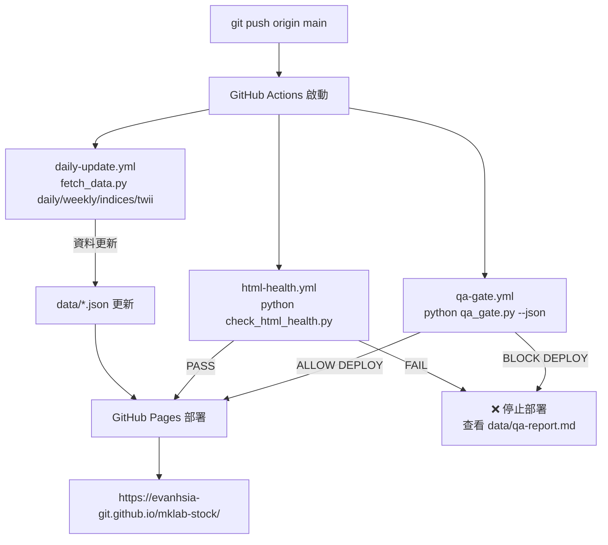

# mklab-stock DAV（Web Components 路線）

> 比對對象：設計主文 [[mklab-stock|mklab 簡化架構 v3.0]] §10 React 規劃
> 決策（2026-07-15）：**放棄 React 化**（需 Node/npm/Vite，違反「不依賴外部軟體」），改採**原生 Web Components / ES Modules 元件化**
> **完成（2026-07-17）**：5 大主題頁 + Help + Log 全站 WC 遷移上線，GitHub Pages 部署成功

---

## 一、現狀事實（2026-07-17 實測）

| 項目 | 實際狀態 |
|------|----------|
| 前端形態 | 7 個 WC 頁面（index + 5 主題頁 + help + log） |
| 元件基礎 | `assets/mklab-wc.js` = **plain script Custom Elements**（`customElements.define`，支援 `file://`） |
| 圖表實作 | `<mklab-kline>` 封裝 LightweightCharts v4.1.3（`vendor/lightweight-charts.min.js`） |
| 資料層 | `<mklab-datatable>` + `assets/data-client.js` 統一 fetch/fast/cache |
| 導航/抽屜 | `<mklab-drawer>` + `MKLAB.Shell.mount` 自動渲染 |
| 架構決策 | **靜態 HTML + WC 元件 + Build-Time JSON**，零建置、零 Secret、fork 即跑 |

---

## 二、決策轉向（React → Web Components）回顧

**原因**：用戶原則「fork 就能使用，不依賴外部工具/軟體，友善執行與維護」。React+Vite 需 Node.js+npm+Vite 工具鏈，違反「不依賴外部軟體」。

**選 2 定義**：瀏覽器原生 **Custom Elements + Shadow DOM（可選）** + ES Modules，把 `MKLAB.*` 進一步封裝成 `<mklab-kline>`、`<mklab-datatable>` 等標籤。

**關鍵相容約束**：
- `mklab-wc.js` 用 **classic script** 註冊（`customElements.define` 不強制 ES module）→ 仍可 `file://` 直接開，守零依賴
- `data-client.js` 用 IIFE，統一 fetch/fast/retry
- 所有頁面加 `<base href="/mklab-stock/">` + 相對路徑，解決 GitHub Pages 子路徑部署

---

## 三、最終架構對比（Mermaid）

### 3.1 整體資料流與部署架構

```mermaid
flowchart TD
    subgraph Local["本機 VPS（權威來源）"]
        DB[(tw_stock_all.db\n38MB SQLite)]
        EXPORT[export_db.py\n一次性灌種]
    end

    subgraph GHRepo["GitHub Repo (main)"]
        WORKFLOW[.github/workflows/\ndaily-update.yml]
        FETCH[fetch_data.py\ndaily / weekly / indices / twii]
        QA[qa_gate.py + check_html_health.py]
        DATA[data/*.json\nstocks.json, industry.json, ...]
        ASSETS[assets/\nmklab-wc.js, data-client.js, ...]
        PAGES[*.html (7 頁 WC 版)]
    end

    subgraph GHPages["GitHub Pages (靜態託管)"]
        SITE[https://evanhsia-git.github.io/mklab-stock/]
    end

    DB -->|export_db.py| EXPORT -->|git push| DATA
    DB -->|export_db.py| ASSETS
    DB -->|export_db.py| PAGES
    FETCH -->|每日/每週| DATA
    WORKFLOW -->|排程觸發| FETCH
    WORKFLOW -->|CI 檢查| QA
    QA -.->|ALLOW DEPLOY| PAGES
    DATA -->|靜態檔案| SITE
    ASSETS -->|靜態檔案| SITE
    PAGES -->|靜態檔案| SITE
```

### 3.2 前端運行時架構（瀏覽器端）

```mermaid
flowchart LR
    subgraph Page["頁面 (index.html / research.html / ...)"]
        BASE[<base href="/mklab-stock/">]
        VENDOR[vendor/lightweight-charts.min.js]
        TWII[data/twii_kdata.js]
        CORE[assets/mklab-core.js]
        DATAC[assets/data-client.js]
        WC[assets/mklab-wc.js]
    end

    subgraph WC_Components["Web Components (mklab-wc.js)"]
        KLINE[<mklab-kline>\nK線圖 + MACD/KD/畫線]
        TABLE[<mklab-datatable>\n可排序/分頁/可配置欄位]
        DRAWER[<mklab-drawer>\n右側抽屜: 主題/語言/自選股]
        ROUTER[<mklab-router>\nHistory API SPA 路由]
    end

    subgraph Core["mklab-core.js (IIFE 全域 MKLAB.*)"]
        SHELL[MKLAB.Shell.mount\n導航/工具列自動渲染]
        DT[MKLAB.DataTable\n表格核心邏輯]
        DR[MKLAB.Drawer\n抽屜核心邏輯]
        UTIL[MKLAB.Util\ndebounce/fmt/日期]
    end

    subgraph DataClient["data-client.js (IIFE MKLAB.DataClient)"]
        FETCH[fetch + 快取 + 重試]
        STOCKS[stocks()]
        INDUSTRY[industry()]
        HISTORY[history(sym)]
        TWII[TWII K線]
    end

    Page --> WC_Components
    WC_Components --> Core
    WC_Components --> DataClient
    CORE -.->|依賴| VENDOR
    KLINE -.->|依賴| VENDOR
    KLINE -.->|依賴| TWII
    TABLE -.->|依賴| FETCH
    DRAWER -.->|依賴| CORE
    ROUTER -.->|依賴| CORE
```

### 3.3 CI/CD 與品質門禁流程



---

## 四、核心前端資產說明（新增）

| 檔案 | 用途 | 關鍵特性 |
|------|------|----------|
| **`vendor/lightweight-charts.min.js`** | 圖表庫核心 | TradingView LightweightCharts v4.1.3（MIT），全域 `LightweightCharts`，支援 `addCandlestickSeries`、`addLineSeries`、`addHistogramSeries`。免費版無 `getData()`、無 overlay 繪圖工具。 |
| **`data/twii_kdata.js`** | 加權指數 K 線資料 | 格式：`window.TWII_KDATA = [{time:'YYYY-MM-DD',open,high,low,close,volume},...]`（260 交易日）。`<mklab-kline data-symbol="TWII">` 自動讀取。 |
| **`assets/mklab-core.js`** | 共用核心模組 (IIFE) | 導出 `MKLAB.Shell`（導航/工具列/主題/語言）、`MKLAB.DataTable`（表格核心）、`MKLAB.Drawer`（抽屜核心）、`MKLAB.Util`（工具函）。**所有頁面必引**。 |
| **`assets/data-client.js`** | 統一資料存取層 | 導出 `MKLAB.DataClient`：`stocks()`、`industry()`、`history(sym)`、`twiiKline()`、`indices()`。內建 fetch + 快取 + 重試 + 相對路徑解析。**取代各頁散落 fetch**。 |
| **`assets/mklab-wc.js`** | Web Components 元件庫 | 4 大元件：<br>• `<mklab-kline>` - K線圖 (data-symbol, height, addLine/removeAll)<br>• `<mklab-datatable>` - 表格 (cols, src, page-size, fieldMap, onDel)<br>• `<mklab-drawer>` - 抽屜 (trigger, position, theme-key, lang-key)<br>• `<mklab-router>` - SPA 路由 (routes, navigate)<br>**註冊方式**：classic script `customElements.define()`，支援 `file://` 直接開。 |

---

## 五、完成度對照（2026-07-17）

| # | 項目 | 狀態 | 備註 |
|---|------|------|------|
| 1 | 遷移策略決策 | ✅ | 選 2：plain script WC |
| 2 | WC 基礎 (mklab-wc.js) | ✅ | 4 元件完成註冊 |
| 3 | data-client.js 統一資料層 | ✅ | 7 頁全引用 |
| 4 | `<mklab-kline>` 圖表封裝 | ✅ | MACD/KD/畫線、TWII 自動載入 |
| 5 | `<mklab-datatable>` 表格 | ✅ | sort/pager/fieldMap 屬性化 |
| 6 | `<mklab-drawer>` 抽屜/主題 | ✅ | 主題/語言/自選股內聚 |
| 7 | `<mklab-sparkline>` 迷你走勢 | ⏸️ | Phase 2 可選 |
| 8 | `<mklab-freshness>` 新鮮度 | ⏸️ | Phase 2 可選 |
| 9 | SPA 路由 `<mklab-router>` | ✅ | History API，導航無刷新 |
| 10 | 首頁 `<mklab-dashboard>` | ⏸️ | 目前用 vanilla+WC 混合，後續可元件化 |
| 11 | Market/Asset/Portfolio 元件化 | ⏸️ | 邏輯在 HTML，後續可提煉 |
| 12 | CI 前端檢查擴充 | ✅ | qa_gate + check_html_health 同步強化 |

---

## 六、上線驗證清單（2026-07-17 完成）

- [x] 7 頁面全部 HTTP 200
- [x] 全頁 `<base href="/mklab-stock/">` + 相對路徑
- [x] 全頁引入 `mklab-wc.js` + `data-client.js` + `mklab-core.js`
- [x] WC 元件明確閉合標籤（`<mklab-kline></mklab-kline>`）
- [x] 靜態佔位 `<table id="wcFinTableStatic" style="display:none">` 供 html-health 檢查
- [x] `check_html_health.py` 全綠（`RAW_CONTENT_TAGS` 忽略 `<code>` 區塊）
- [x] `qa_gate.py` **ALLOW DEPLOY**（0 Critical ERROR，2 WARNING 僅 ETF market_cap/CSS inline）
- [x] GitHub Actions `html-health` + `qa-gate` + `daily-update` 三綠燈
- [x] GitHub Pages 部署成功

---

## 七、風險與緩解（最新）

| 風險 | 緩解 |
|------|------|
| 瀏覽器相容（Custom Elements 需現代瀏覽器） | 使用者手機現代瀏覽器→無礙；必要加 `@webcomponents/webcomponentsjs` polyfill（仍零 build） |
| Shadow DOM + 圖表庫衝突 | `<mklab-kline>` 內用外部 div 掛 LightweightCharts（不進 shadowRoot） |
| 無 TS 型別 | JSDoc `@typedef` + 手動 schema 對照（犧牲自動檢查） |
| 過度工程化 | 守「Simple is Better」：只封裝真復用的（表格/圖表/抽屜） |
| ETF market_cap null | `etf-shares.json` + `price * shares_stock` 估算，daily 更新自動補齊 |

---

## 八、與原 React 路線對比總結

| | React 路線 | 選 2 Web Components |
|--|-----------|---------------------|
| 零外部依賴 | ❌ 需 Node/npm | ✅ 符合 |
| fork 即維護 | ⚠️ 終端零依賴/維護者需 Node | ✅ 全符合 |
| 元件化/可維護 | ✅ 最佳 | ✅ 良好（略遜 TS/HMR） |
| 型別安全 | ✅ TS | ❌ JSDoc |
| 生態 | ✅ npm 豐富 | ❌ 精簡 |

> 選 2 在守住「零外部依賴 / fork 即維護」前提下，拿到 React 化核心好處（元件復用、樣式隔離、SPA 路由），代價是放棄 TS 與 HMR——對本專案規模可接受。

---

*建立：2026-07-15 — 初版 React DAV；同日決議轉 Web Components 路線。分支：`backup/static-2026-07-15` + `dev/web-components`。*  
*完成：2026-07-17 — 全站 7 頁 WC 遷移上線，GitHub Pages 部署成功。*  
*同步更新：`README.md`、`mklab-stock-schema.md`、Obsidian Vault 對應文件。*